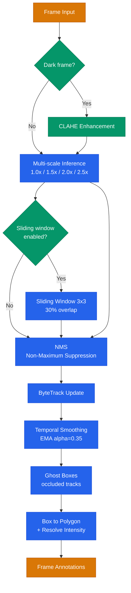
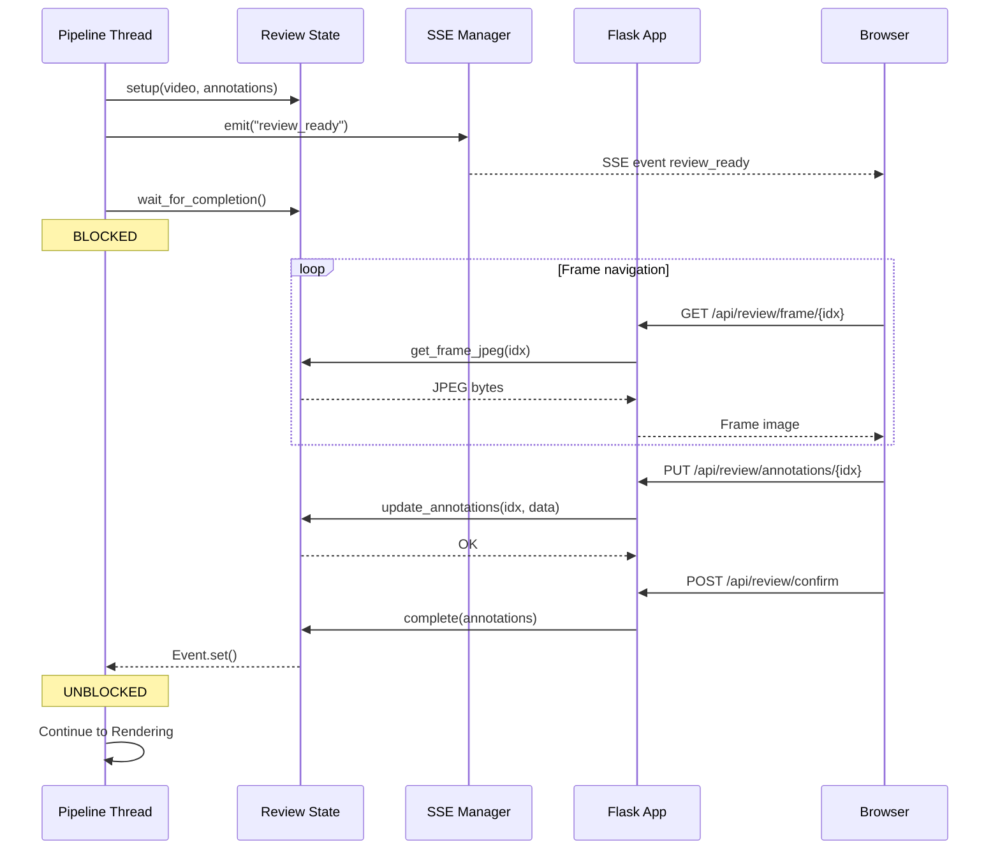
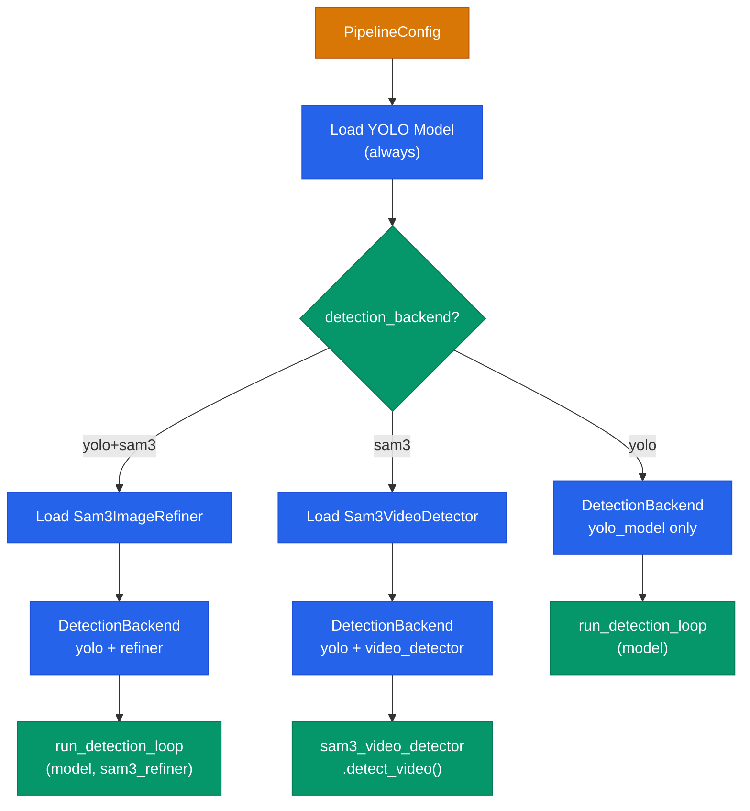

# Architecture - Person Anonymizer

Technical diagrams for the detection pipeline, web review interaction, and backend selection.

For the high-level overview and pipeline flow, see the [README](../README.md).

---

## Detection Stage Internals

Each frame passes through a multi-step processing pipeline inside `stage_detection.py`. CLAHE enhancement activates only for dark frames. Multi-scale inference runs at 4 scales, with an optional 3x3 sliding window for small targets. After NMS, ByteTrack assigns persistent IDs, and temporal smoothing (EMA) stabilizes bounding boxes across frames. Ghost boxes keep anonimization active for temporarily occluded persons.

**Key modules:** `detection.py` (multi-scale + NMS), `tracking.py` (ByteTrack + TemporalSmoother), `preprocessing.py` (CLAHE + motion detection).

---

## Web Review Sequence

When `mode=manual`, the pipeline thread blocks until the user confirms annotations via the web browser. `ReviewState` bridges the pipeline thread and Flask request threads using `threading.Event`. SSE pushes real-time status updates to the browser.

**Key modules:** `web/review_state.py` (thread-safe state bridge), `web/sse_manager.py` (event distribution), `web/routes_review.py` (REST endpoints), `stage_review.py` (pipeline integration).

---

## Backend Factory - Detection Mode Selection

`backend_factory.py` implements the factory pattern for detection backends. YOLO is always loaded as the base model. SAM3 components are conditionally loaded based on the `detection_backend` config parameter.

| Mode | Detection | Segmentation | GPU Requirement |
|------|-----------|--------------|-----------------|
| `yolo` | YOLO v8 multi-scale | Bounding box to polygon | CUDA recommended, CPU supported |
| `yolo+sam3` | YOLO v8 | SAM3 refines masks per-frame | CUDA required |
| `sam3` | SAM3 end-to-end | SAM3 pixel-precise masks | CUDA required, 8+ GB VRAM |

**Key modules:** `backend_factory.py` (factory + `DetectionBackend` dataclass), `sam3_backend.py` (`Sam3ImageRefiner`, `Sam3VideoDetector`).
