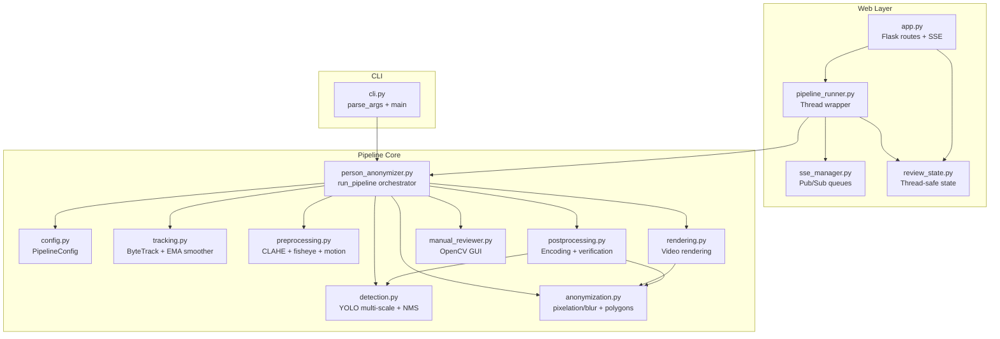

# Architecture Review -- Person Anonymizer v7.1

**Data**: 2026-04-01
**Reviewer**: Senior Architect
**Scope**: Analisi completa dell'architettura, moduli Python, pattern, accoppiamento, testabilita

---

## 1. Panoramica Architetturale

```
person_anonymizer/
  config.py              (99 righe)   -- PipelineConfig dataclass
  person_anonymizer.py   (995 righe)  -- Pipeline principale + CLI
  detection.py           (204 righe)  -- YOLO multi-scala + NMS
  tracking.py            (169 righe)  -- ByteTrack + TemporalSmoother
  anonymization.py       (189 righe)  -- Oscuramento + box/poligono
  preprocessing.py       (131 righe)  -- CLAHE, fisheye, motion detection
  postprocessing.py      (377 righe)  -- Encoding, post-render check, normalization
  rendering.py           (193 righe)  -- Rendering video + review stats
  manual_reviewer.py     (477 righe)  -- GUI OpenCV per revisione manuale
  camera_calibration.py  (140 righe)  -- Utility calibrazione
  web/
    app.py               (465 righe)  -- Flask app con endpoint REST + SSE
    pipeline_runner.py   (489 righe)  -- Thread wrapper per pipeline + cattura output
    sse_manager.py       (54 righe)   -- Pub/sub SSE thread-safe
    review_state.py      (205 righe)  -- Stato review condiviso tra thread
tests/
  10 file di test
```

**Architettura**: monolite modulare procedurale con layer web Flask sovrapposto. La pipeline
segue un pattern lineare a 5 fasi: Detection -> Refinement -> Manual Review -> Rendering -> Post-processing.

---

## 2. Verdetto Sintetico

| Aspetto | Voto | Note |
|---------|------|------|
| Separazione responsabilita (SRP) | 6/10 | Buona decomposizione moduli, ma `person_anonymizer.py` e God File |
| Accoppiamento | 5/10 | Accoppiamento implicito tramite `args` namespace con attributi privati |
| Pattern architetturali | 7/10 | Pipeline lineare appropriata, SSE pub/sub corretto |
| Gestione configurazione | 8/10 | `PipelineConfig` dataclass centralizzata, validazione web solida |
| Gestione errori | 6/10 | Gerarchia eccezioni presente, ma `print()` per output misto a pipeline logic |
| Scalabilita del design | 5/10 | Single-threaded pipeline, no async, un solo job alla volta |
| Testabilita | 7/10 | Funzioni pure ben testate, mock appropriati per cv2/YOLO |
| Organizzazione file | 7/10 | Struttura chiara, naming coerente |
| Interfacce pubbliche | 5/10 | Nessun `__init__.py` con esportazioni esplicite, import relativi assenti |
| Anti-pattern | -- | 8 anti-pattern identificati (vedi sezione 4) |

**Voto complessivo: 6.2/10** -- Buona base, ma serve refactoring strutturale per maturita production-grade.

---

## 3. Analisi Dettagliata per Criterio

### 3.1 Separazione delle Responsabilita (SRP)

**Positivo**:
- I moduli `detection.py`, `tracking.py`, `anonymization.py`, `preprocessing.py` hanno
  responsabilita chiare e delimitate
- `SSEManager` e `ReviewState` sono ben focalizzati su un singolo dominio
- `PipelineConfig` centralizza tutta la configurazione evitando variabili globali sparse

**Critico**:

**F01 -- `person_anonymizer.py` e un God File (995 righe)**

Questo file contiene: orchestrazione pipeline, CLI parsing, inizializzazione processori,
logica di detection loop, refinement loop, manual review orchestration, output saving,
stampa formattata del summary. Viola massicciamente SRP.

| Responsabilita nel file | Righe circa | Dove dovrebbe stare |
|-------------------------|-------------|---------------------|
| Dataclass `OutputPaths`, `VideoMeta`, `PipelineResult`, `FrameProcessors` | 60 | `models.py` |
| `_load_annotations_from_json` | 35 | `postprocessing.py` o `annotations.py` |
| `_init_frame_processors` | 35 | `pipeline_setup.py` o metodo factory |
| `_process_single_frame` | 95 | `detection.py` (e il modulo piu appropriato) |
| `_run_detection_loop` | 85 | `pipeline_stages.py` |
| `_run_refinement_loop` | 115 | `pipeline_stages.py` |
| `_run_manual_review` | 75 | `pipeline_stages.py` |
| `_save_outputs` | 95 | `output.py` |
| `run_pipeline` (orchestratore) | 260 | Resta qui, ma snellito |
| CLI `parse_args` + `main` | 55 | `cli.py` |

**Soluzione**: Scomporre in 4-5 moduli:
```
person_anonymizer/
  pipeline.py          -- run_pipeline() orchestratore snello (~150 righe)
  pipeline_stages.py   -- detection_loop, refinement_loop, manual_review
  output.py            -- save_outputs, load_annotations_from_json
  models.py            -- OutputPaths, VideoMeta, PipelineResult, FrameProcessors
  cli.py               -- parse_args, main
```

**F02 -- `postprocessing.py` ha troppe responsabilita (377 righe)**

Contiene encoding video (ffmpeg), verifica post-rendering (secondo passaggio YOLO),
filtro artefatti, merge poligoni sovrapposti (union-find), e normalizzazione annotazioni.
Sono almeno 3 domini distinti.

**Soluzione**: Separare in `encoding.py` (ffmpeg), `verification.py` (post-render check +
filtro artefatti), e spostare `normalize_annotations` + merge rects in `annotations.py`.

---

### 3.2 Accoppiamento tra Moduli

**Positivo**:
- I moduli core (`detection`, `tracking`, `anonymization`, `preprocessing`) comunicano
  tramite strutture dati semplici (liste di box, ndarray, tuple)
- Nessuna dipendenza circolare rilevata
- `PipelineConfig` e passato come parametro esplicito

**Critico**:

**F03 -- Accoppiamento implicito tramite `args` namespace con attributi privati**

Il bridge web-pipeline usa `SimpleNamespace` con attributi nascosti:
```python
args._stop_event = self._stop_event
args._review_state = self.review_state
args._sse_manager = self._sse
args._job_id = job_id
```

Poi in `person_anonymizer.py`:
```python
web_review_state = getattr(args, "_review_state", None)
sse_mgr = getattr(args, "_sse_manager", None)
web_job_id = getattr(args, "_job_id", None)
```

Questo crea un contratto implicito non tipizzato tra web e pipeline. Se un attributo
viene rinominato, nessun IDE o type checker lo segnala.

**Soluzione**: Definire un protocollo o dataclass `PipelineContext` esplicito:
```python
@dataclass
class PipelineContext:
    input: str
    mode: str
    method: str | None
    output: str | None
    no_debug: bool = False
    no_report: bool = False
    review: str | None = None
    normalize: bool = False
    stop_event: threading.Event | None = None
    review_state: ReviewState | None = None
    sse_manager: SSEManager | None = None
    job_id: str | None = None
```

**F04 -- `ManualReviewer.__init__` riceve `config` come `dict`, non `PipelineConfig`**

A differenza di tutti gli altri moduli che ricevono `PipelineConfig`, il `ManualReviewer`
riceve un dict con chiavi diverse (`auto_color` vs `review_auto_color`). Questo crea una
mappatura manuale in `_run_manual_review`:
```python
review_config = {
    "auto_color": config.review_auto_color,
    "manual_color": config.review_manual_color,
    ...
}
```

**Soluzione**: Far accettare a `ManualReviewer` direttamente `PipelineConfig` e leggere
gli attributi `review_*` al suo interno. Elimina la mappatura e il rischio di mismatch.

---

### 3.3 Pattern Architetturali

**Appropriati**:

- **Pipeline lineare a fasi**: Pattern corretto per elaborazione video sequenziale.
  Le 5 fasi (detect -> refine -> review -> render -> post-process) sono logicamente ordinate
- **Pub/Sub per SSE**: `SSEManager` con code per subscriber e un pattern corretto per
  Server-Sent Events multi-client
- **Thread separation**: La pipeline gira in un daemon thread separato dal web server,
  con `threading.Event` per la cooperazione (stop, review completion)
- **Monkey-patching di tqdm**: Soluzione pragmatica per catturare il progresso senza
  modificare la pipeline core. Non e elegante ma funziona e isola bene le due modalita

**Inappropriati/Mancanti**:

**F05 -- Nessun pattern di pipeline stage formale**

Le fasi sono funzioni libere chiamate in sequenza dentro `run_pipeline()`. Se si vuole
aggiungere una fase, modificare l'ordine, o rendere una fase opzionale in modo dichiarativo,
bisogna modificare l'orchestratore. Un pattern Pipeline/Chain of Responsibility renderebbe
il flusso estensibile.

**Soluzione (livello 1 -- pragmatico)**:
```python
# Non serve un framework: basta un registro ordinato
PIPELINE_STAGES = [
    ("detection", run_detection_stage),
    ("refinement", run_refinement_stage),
    ("review", run_review_stage),
    ("rendering", run_rendering_stage),
    ("postprocessing", run_postprocessing_stage),
]

def run_pipeline(context, config):
    for name, stage_fn in PIPELINE_STAGES:
        if context.stop_event and context.stop_event.is_set():
            break
        stage_fn(context, config)
```

**Soluzione (livello 2 -- se necessario)**:
Classe `PipelineStage` con metodo `execute(context, config) -> StageResult` e
`should_skip(context, config) -> bool`. Permette composizione, logging, metriche per fase.

---

### 3.4 Gestione della Configurazione

**Positivo**:
- `PipelineConfig` dataclass con 40+ parametri e valori di default sensati
- Validazione server-side nel web layer con `_CONFIG_VALIDATORS` e `_ALLOWED_FIELDS`
- Whitelist esplicita dei campi modificabili dall'utente web

**Critico**:

**F06 -- Nessuna validazione in `PipelineConfig` stessa**

La dataclass non ha `__post_init__`. Qualsiasi valore puo essere assegnato:
```python
config = PipelineConfig(detection_confidence=-5.0, ghost_frames="banana")
# Nessun errore fino al crash a runtime
```

La validazione esiste solo nel web layer (`pipeline_runner.py`), quindi il CLI path
non ha nessuna protezione.

**Soluzione**: Aggiungere `__post_init__` con validazione:
```python
def __post_init__(self):
    if not (0.01 <= self.detection_confidence <= 0.99):
        raise ValueError(f"detection_confidence deve essere tra 0.01 e 0.99, ricevuto {self.detection_confidence}")
    if self.anonymization_intensity < 1 or self.anonymization_intensity > 100:
        raise ValueError(...)
    # ...
```

In alternativa, usare Pydantic v2 `BaseModel` che offre validazione dichiarativa.
Ma per mantenere zero dipendenze extra, `__post_init__` e sufficiente.

---

### 3.5 Gestione degli Errori e Resilienza

**Positivo**:
- Gerarchia eccezioni: `PipelineError` -> `PipelineInputError`
- Fallback graceful in `encode_with_audio` (audio -> no audio -> copia grezza)
- Fallback in `update_tracker` (tracker fallisce -> box senza tracking)
- `corrupted_frames` tracking sia in detection che in rendering
- Rate limiting sugli endpoint web
- Security headers completi (CSP, HSTS, X-Frame-Options, ecc.)

**Critico**:

**F07 -- Output su stdout mischiato con logica di pipeline**

La pipeline usa `print()` per 40+ messaggi di stato, stampe di statistiche, warning.
Questo crea problemi:

1. Il monkey-patching di `StdoutCapture` intercetta tutto stdout, incluso output
   di librerie terze, creando potenziali conflitti
2. Impossibile controllare il livello di verbosita (quiet mode, verbose mode)
3. Il parsing regex di `StdoutCapture._PHASE_RE` per estrarre la fase corrente
   e fragile: dipende dal formato esatto della stringa `[FASE X/5]`

**Soluzione**: Sostituire tutti i `print()` con `logging.getLogger(__name__)`:
```python
_log = logging.getLogger(__name__)
_log.info("[FASE 1/5] Rilevamento automatico...")
_log.info("  Persone tracciate (ID unici): %d", len(unique_ids))
```

Per il web, usare un `logging.Handler` custom che emette SSE, invece di monkey-patchare
stdout. Questo elimina `StdoutCapture` e il suo parsing fragile.

Per tqdm, usare il parametro `file=` nativo:
```python
pbar = tqdm(total=total_frames, desc="Elaborazione", file=log_stream)
```

**F08 -- `VideoCapture` non chiuso in caso di eccezione in `run_pipeline`**

Se un'eccezione viene lanciata tra `cv2.VideoCapture(input_path)` (riga 722) e
`cap.release()` (riga 370 nel detection loop, o 824 nel json path), il file handle
resta aperto. Manca un context manager o un try/finally.

**Soluzione**: Wrappare in context manager:
```python
class VideoCapture:
    def __init__(self, path):
        self.cap = cv2.VideoCapture(path)
        if not self.cap.isOpened():
            raise PipelineInputError(f"Impossibile aprire: {path}")
    def __enter__(self):
        return self.cap
    def __exit__(self, *args):
        self.cap.release()
```

---

### 3.6 Scalabilita del Design

**Limiti strutturali**:

- **Un solo job alla volta**: `PipelineRunner` ha un singolo `_thread` e rifiuta
  job concorrenti con HTTP 409. Per uno strumento single-user e accettabile, ma non
  scala con piu utenti
- **Nessun job persistence**: Se il server crasha, non c'e modo di riprendere un job.
  Lo stato vive solo in memoria (thread + queue)
- **File temporanei nella stessa directory**: I temp `.avi` vivono accanto all'output.
  Con piu job, servirebbero directory temporanee dedicate (gia fatto nel web path con
  `job_dir`, ma non nel CLI path)
- **Nessun limite dimensione coda SSE**: Se un client si disconnette senza unsubscribe,
  la coda cresce senza limiti fino al `close()`

**Soluzione per la coda SSE**:
```python
q = Queue(maxsize=100)  # Backpressure
# In emit():
try:
    q.put_nowait(event)
except Full:
    pass  # Drop oldest or skip
```

**Non e un problema ora**: Il design single-job e appropriato per un tool di nicchia
per sorveglianza. Non serve un sistema distribuito. Ma se in futuro servisse gestire
piu video in parallelo, l'architettura richiederebbe un refactoring significativo del
`PipelineRunner`.

---

### 3.7 Testabilita del Codice

**Positivo**:
- 10 file di test che coprono config, detection, tracking, anonymization, postprocessing,
  rendering, web, e errori pipeline
- Funzioni pure senza side-effect (detection, NMS, IoU, box_to_polygon) sono facilmente
  testabili
- I test web usano il Flask test client con rate limiting disabilitato
- `conftest.py` configura correttamente il path

**Critico**:

**F09 -- `_process_single_frame` non e testabile in isolamento**

Questa funzione (95 righe) dipende da: `enhance_frame`, `MotionDetector`, `run_full_detection`,
`apply_nms`, `update_tracker`, `TemporalSmoother.smooth`, `compute_adaptive_intensity`,
`box_to_polygon`, `interpolate_frames`. Troppe dipendenze per un unit test significativo.

**Soluzione**: La funzione e gia una composizione di funzioni pure testate singolarmente.
Il test appropriato e un integration test con fixture pre-costruite per `FrameProcessors`
e un frame sintetico.

**F10 -- Peso del modello YOLO nel repository**

I file `yolov8n.pt` (6.5 MB) e `yolov8x.pt` (137 MB) sono nella directory del codice.
Non impediscono i test (che li mockano), ma appesantiscono il clone e non dovrebbero
essere in version control.

**Soluzione**: Aggiungere `*.pt` a `.gitignore` e fornire uno script di download:
```bash
# scripts/download_models.sh
wget -P person_anonymizer/ https://github.com/ultralytics/assets/releases/download/v8.1.0/yolov8n.pt
wget -P person_anonymizer/ https://github.com/ultralytics/assets/releases/download/v8.1.0/yolov8x.pt
```

---

### 3.8 Organizzazione dei File e Moduli

**Positivo**:
- Separazione chiara `person_anonymizer/` (src) vs `tests/` vs `web/`
- Naming coerente in snake_case
- `pyproject.toml` con ruff e pytest configurati
- `requirements.txt` con versioni pinnate

**Critico**:

**F11 -- Import con path manipulation invece di package structure**

```python
# web/app.py
PARENT_DIR = Path(__file__).resolve().parent.parent
sys.path.insert(0, str(PARENT_DIR))
```

```python
# conftest.py
sys.path.insert(0, str(Path(__file__).resolve().parent.parent / "person_anonymizer"))
```

Tutti gli import sono assoluti (`from config import PipelineConfig`) ma funzionano
solo grazie a `sys.path` manipulation. Non c'e un `__init__.py` nella root del package
e non c'e un `setup.py`/`pyproject.toml` installabile.

**Soluzione**: Rendere il progetto un package installabile:
```
person_anonymizer/
  __init__.py          # Esporta run_pipeline, PipelineConfig
  config.py
  ...
```

In `pyproject.toml`:
```toml
[tool.setuptools.packages.find]
where = ["."]
include = ["person_anonymizer*"]
```

E usare import relativi dentro il package:
```python
from .config import PipelineConfig
from .detection import run_full_detection
```

Questo elimina tutto il `sys.path` manipulation e rende il package installabile
con `pip install -e .`.

---

### 3.9 Interfacce Pubbliche vs Dettagli Implementativi

**Critico**:

**F12 -- Nessuna separazione tra API pubblica e dettagli interni**

Tutti i moduli esportano tutto. Non c'e distinzione tra:
- `run_full_detection` (che dovrebbe essere l'unico entry point di `detection.py`)
- `get_window_patches`, `patch_intersects_motion`, `detect_and_rescale` (dettagli interni)

Stesso problema in `postprocessing.py`: `normalize_annotations` e l'API pubblica,
ma `_rects_overlap`, `_merge_rects`, `_merge_overlapping_rects` sono correttamente
prefissati con `_`. Buon pattern, ma non applicato ovunque.

**Soluzione**: In ogni modulo, definire `__all__` per le esportazioni pubbliche:
```python
# detection.py
__all__ = ["run_full_detection", "apply_nms", "compute_iou_boxes"]
```

E prefissare con `_` le funzioni interne non usate da altri moduli.

---

## 4. Anti-Pattern Identificati

### AP01 -- God File

`person_anonymizer.py` con 995 righe contiene 10+ responsabilita distinte.
**Gravita**: ALTA
**Vedi**: F01

### AP02 -- Contratto Implicito via Namespace

`SimpleNamespace` con attributi `_private` come interfaccia tra web e pipeline.
**Gravita**: MEDIA
**Vedi**: F03

### AP03 -- Print-Driven Development

40+ `print()` nella pipeline core, con monkey-patching di stdout per il web.
**Gravita**: MEDIA
**Vedi**: F07

### AP04 -- Inconsistent Config Interface

`ManualReviewer` riceve `dict` mentre tutto il resto riceve `PipelineConfig`.
**Gravita**: BASSA
**Vedi**: F04

### AP05 -- Path Manipulation invece di Package

`sys.path.insert(0, ...)` in 3 posti diversi invece di package installabile.
**Gravita**: MEDIA
**Vedi**: F11

### AP06 -- Validazione Solo al Perimetro Web

`PipelineConfig` non valida i propri valori. Il CLI path non ha protezione.
**Gravita**: MEDIA
**Vedi**: F06

### AP07 -- Resource Leak Potenziale

`cv2.VideoCapture` non wrappato in context manager in `run_pipeline`.
**Gravita**: BASSA (Python garbage collector mitiga, ma non deterministico)
**Vedi**: F08

### AP08 -- Binary Assets in Repository

Modelli YOLO (143 MB totali) probabilmente nel git history.
**Gravita**: BASSA (non impatta il runtime)
**Vedi**: F10

---

## 5. Diagramma Architetturale



---

## 6. Roadmap di Refactoring (priorita decrescente)

### Fase 1 -- Quick Wins (1-2 giorni, impatto alto)

| ID | Azione | Finding | Effort |
|----|--------|---------|--------|
| R01 | Scomporre `person_anonymizer.py` in 5 moduli | F01, AP01 | 4h |
| R02 | Sostituire `SimpleNamespace` con `PipelineContext` dataclass tipizzata | F03, AP02 | 2h |
| R03 | Aggiungere `__post_init__` a `PipelineConfig` | F06, AP06 | 2h |
| R04 | Aggiungere `__all__` a tutti i moduli | F12 | 1h |

### Fase 2 -- Debito Tecnico (2-3 giorni, impatto medio)

| ID | Azione | Finding | Effort |
|----|--------|---------|--------|
| R05 | Migrare `print()` a `logging` in tutta la pipeline | F07, AP03 | 4h |
| R06 | Rendere il progetto un package installabile con `pip install -e .` | F11, AP05 | 2h |
| R07 | Scomporre `postprocessing.py` in `encoding.py` + `verification.py` | F02 | 2h |
| R08 | Far accettare `PipelineConfig` a `ManualReviewer` | F04, AP04 | 1h |
| R09 | Context manager per `VideoCapture` | F08, AP07 | 1h |
| R10 | Aggiungere `maxsize` alla coda SSE | 3.6 | 0.5h |

### Fase 3 -- Evoluzione (opzionale, impatto a lungo termine)

| ID | Azione | Finding | Effort |
|----|--------|---------|--------|
| R11 | Pipeline stage pattern dichiarativo | F05 | 4h |
| R12 | Logging handler SSE invece di monkey-patch stdout/tqdm | F07 | 4h |
| R13 | Spostare modelli `.pt` fuori dal repo + script download | F10, AP08 | 1h |

---

## 7. Cosa Funziona Bene (da preservare)

1. **`PipelineConfig` centralizzata**: Eccellente scelta rispetto a 42 variabili globali.
   La dataclass con default sensati e il pattern giusto per questo tipo di tool

2. **Decomposizione dei moduli core**: `detection.py`, `tracking.py`, `anonymization.py`,
   `preprocessing.py` sono ben delimitati con funzioni pure e testabili

3. **Thread-safety nel web layer**: `ReviewState` con lock granulare, `SSEManager`
   con pub/sub corretto, `PipelineRunner` con mutex per lo stato

4. **Resilienza**: Fallback a cascata in encoding, gestione frame corrotti, fallback
   tracker, graceful degradation senza ffmpeg

5. **Security nel web layer**: Validazione job_id con regex, path traversal prevention,
   CSP headers, rate limiting, secure_filename, content length limit

6. **Validazione input web**: `_CONFIG_VALIDATORS` con whitelist `_ALLOWED_FIELDS`
   e `_BOOL_FIELDS` e un pattern solido di difesa in profondita

7. **Test suite**: Copertura dei moduli critici con mock appropriati, senza dipendenze
   da GPU o modelli reali

---

## 8. Conclusione

L'architettura e **funzionalmente solida** per un tool single-user di anonimizzazione video.
I moduli core sono ben progettati con funzioni pure e responsabilita chiare. Il web layer
ha una sicurezza superiore alla media per un progetto personale.

I problemi principali sono **strutturali, non funzionali**: il God File `person_anonymizer.py`,
l'accoppiamento implicito web-pipeline via namespace, e il print-driven output. Questi non
causano bug oggi, ma rendono il codice fragile per evoluzioni future.

La Fase 1 della roadmap (1-2 giorni) risolverebbe i 4 problemi piu impattanti e porterebbe
il voto complessivo da 6.2 a ~7.5/10. La Fase 2 aggiungerebbe solidita professionale.
La Fase 3 e opzionale e da considerare solo se il progetto cresce in complessita.
